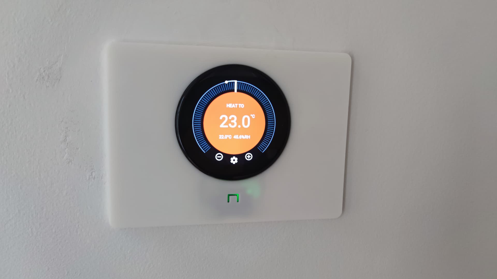
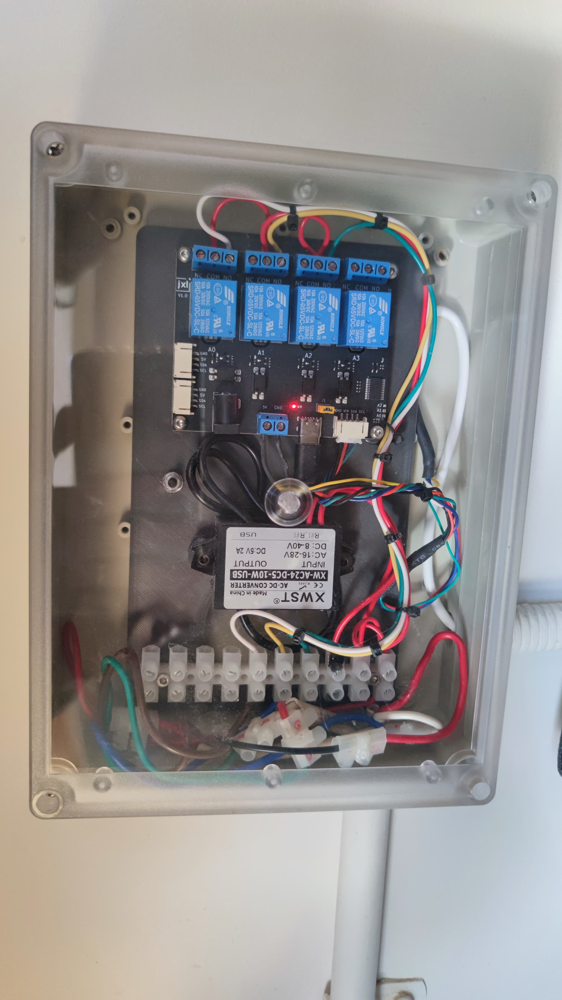
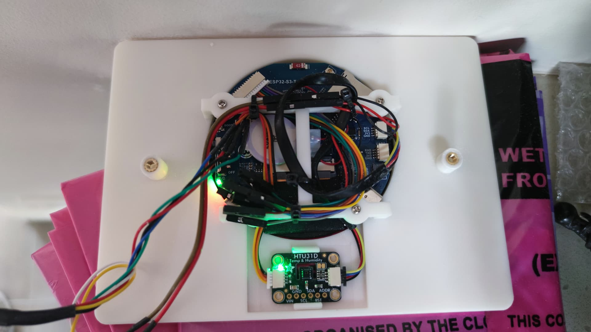

# neo-nESP -- Nest Thermostat clone on a Rotary Display running ESPHome

Parts:

Hardware device https://www.waveshare.com/esp32-s3-touch-lcd-2.1.htm (I used the curved edge version)

24 VAC to 5V DC converter : https://www.aliexpress.com/item/4000971746921.html?spm=a2g0o.order_list.order_list_main.15.21ef1802hpYIvM (Type C USB version)

I2C 4 relay board : https://www.aliexpress.com/item/1005005888153297.html?spm=a2g0o.order_list.order_list_main.20.21ef1802hpYIvM

I2C temperature and hunidity sensor : https://core-electronics.com.au/adafruit-htu31-temperature-humidity-sensor-breakout-board-stemma-qt-qwiic.html

6 core "alarm cable" : https://www.jaycar.com.au/6-core-alarm-cable/p/WB1598 (I used 3m)

longer I2C cable for sensor : https://core-electronics.com.au/stemma-qt-qwiic-jst-sh-4-pin-cable-200mm-long.html

> [Discussion on community.home-assistant.io](https://community.home-assistant.io/t/esphome-nest-thermostat-clone-on-cheap-rotary-display/)

> [Discussion on Discord](https://discord.com/channels/429907082951524364/1275465022654648362)

## Usage

* Touch screen controlled.

## Features 

* Removed Zones and weather forecast.
* Works standalone but can also be controlled by Home Assistant.
* Supports Heating, Cooling and Fan single speed modes.

## Special Thanks

* velijv for [original project](https://github.com/velijv/nesp/) and kancelott for the fork rewrite.
