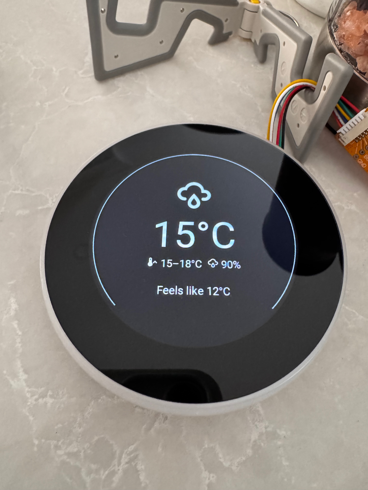
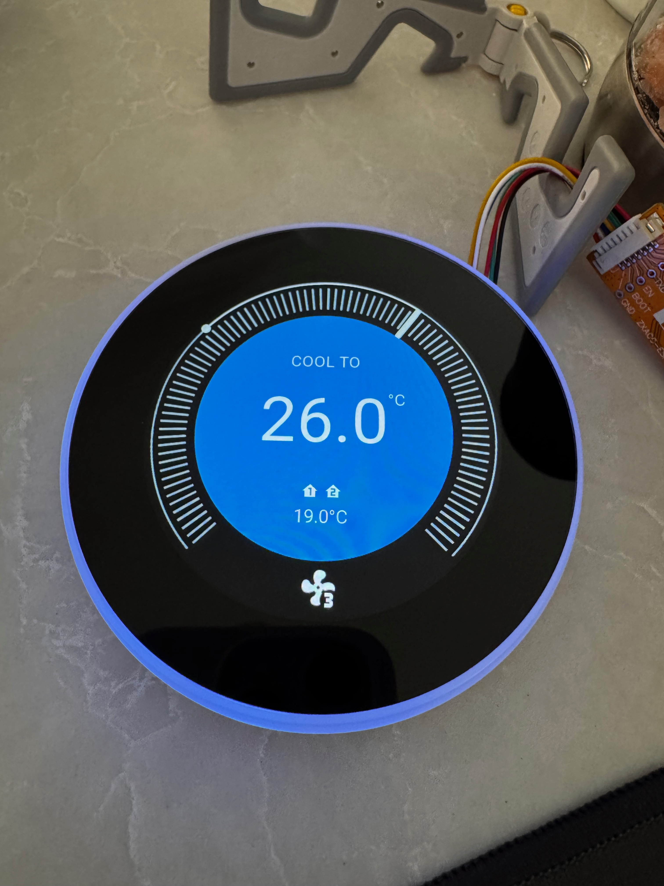
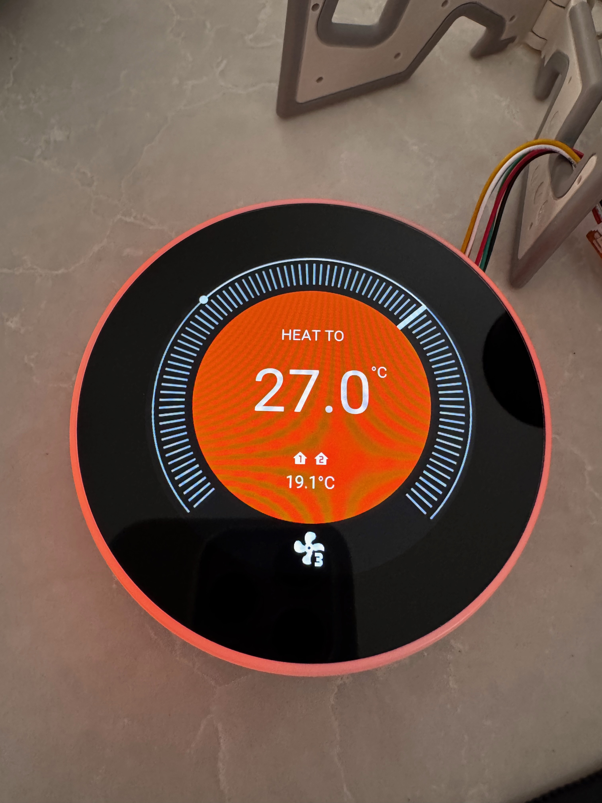
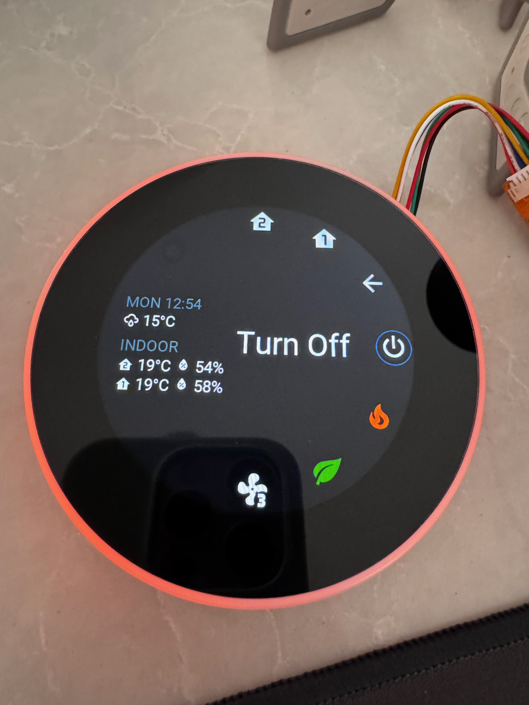

# neo-nESP -- Nest Thermostat clone on a Rotary Display running ESPHome

Hardware device (AliExpress): [WT32S3-21S ZX2D10GE01R-V4848 2.1" 480x480 rotary switch screen](https://www.aliexpress.com/item/1005006102533124.html) 

> [Discussion on community.home-assistant.io](https://community.home-assistant.io/t/esphome-nest-thermostat-clone-on-cheap-rotary-display/)

> [Discussion on Discord](https://discord.com/channels/429907082951524364/1275465022654648362)

## Usage

* Turn rotary knob to adjust set temperature on main screen.
* Press centre button to bring up menu to control HVAC.

## Features 

* Ambient display of weather when HVAC is off.
* Two cover entities for zone support.

Will probably need some modification of the yaml to suit the entities for your Home Assistant install. You can delete the sections not relevant to you (e.g. zoning, weather); unfortunately they might be scattered throughout the code.

## Screenshots

## Special Thanks

* velijv for [original project](https://github.com/velijv/nesp/)
